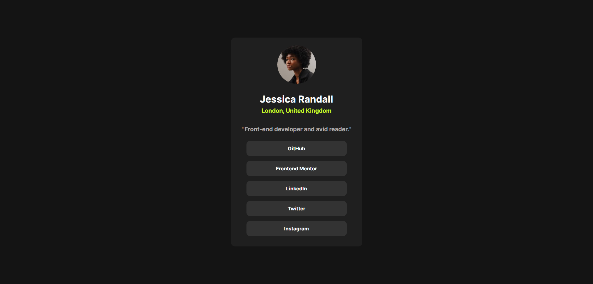

# Frontend Mentor - Social links profile solution

This is a solution to the [Social links profile challenge on Frontend Mentor](https://www.frontendmentor.io/challenges/social-links-profile-UG32l9m6dQ). Frontend Mentor challenges help you improve your coding skills by building realistic projects. 

## Table of contents

- [Overview](#overview)
  - [The challenge](#the-challenge)
  - [Screenshot](#screenshot)
  - [Links](#links)
- [My process](#my-process)
  - [Built with](#built-with)
  - [What I learned](#what-i-learned)
  - [Continued development](#continued-development)
  - [Useful resources](#useful-resources)
- [Author](#author)

## Overview

### The challenge

Users should be able to:

- See hover and focus states for all interactive elements on the page.
- View the site for both mobile and desktop.
### Screenshot

### Links

- Live Site URL: [https://prisma-not-available.github.io/social-links-profile/](https://prisma-not-available.github.io/social-links-profile/)

## My process

### Built with

- Semantic HTML5 markup
- CSS custom properties
- Flexbox
- Mobile-first workflow

### What I learned  

I learned that there is a thing called "Mobile-first approach" since i mostly worked with desktop view and did not bother on responsiveness of the website, so i also learned or have some ideas about media queries which i did not get a chance to apply in this one, but i practiced it using another html file and it went great.

### Continued development

I want to focus more on accessibility and responsive design and deep dive into media queries.

### Useful resources

- [W3Schools](https://www.w3schools.com/css/default.asp) - This helped me for styling. there are some properties that i keep forgetting like flexbox properties and this website is my go-to everytime. i recommend this to anyone who is also starting in web development or in technology in general like me.

## Author

- Frontend Mentor - [@diverza](https://www.frontendmentor.io/profile/prisma-not-available)

